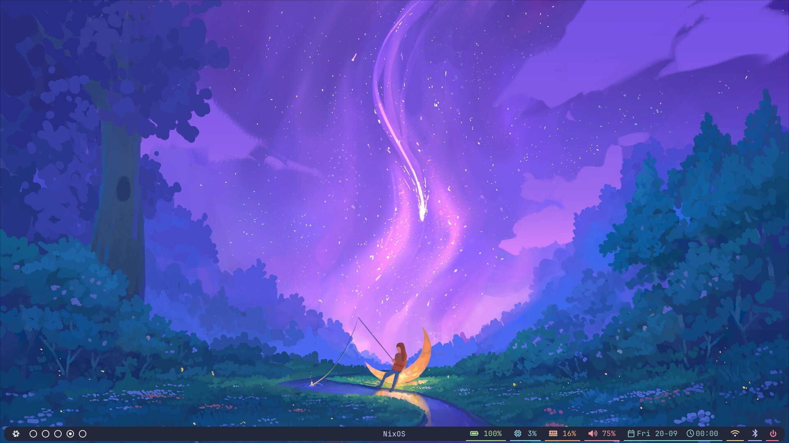
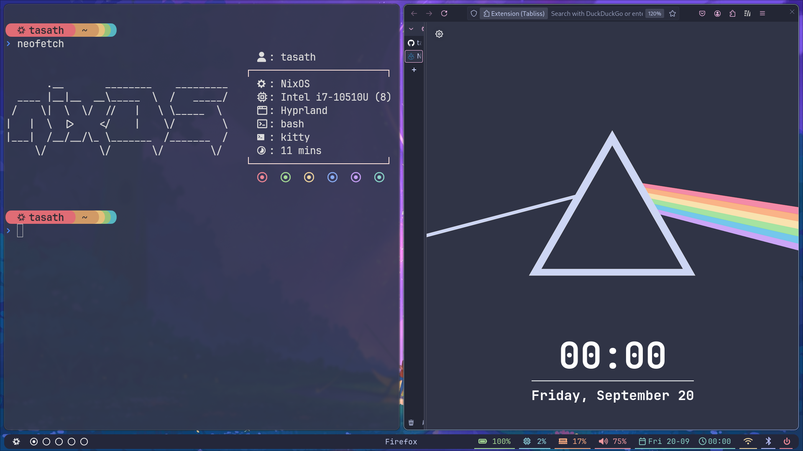
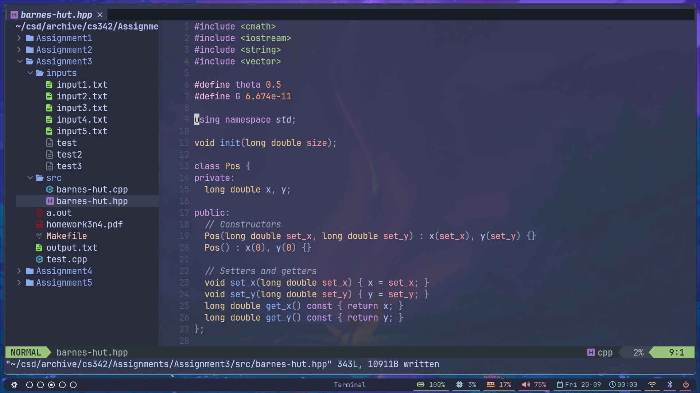
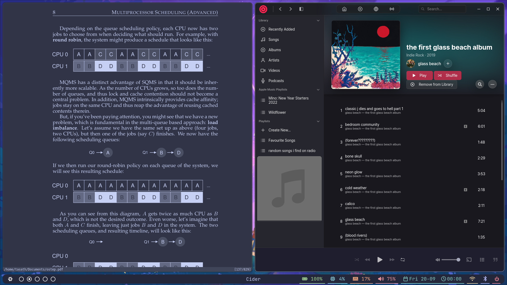

# dotfiles
Config for my NixOS/Hyprland setup.


(still a work in progress)

# Screenshots






# Installation
```
git clone https://github.com/tasath26/.dotfiles ~
cp -r ~/.dotfiles/.config/* ~/.config
rm -rf ~/.dotfiles
```
